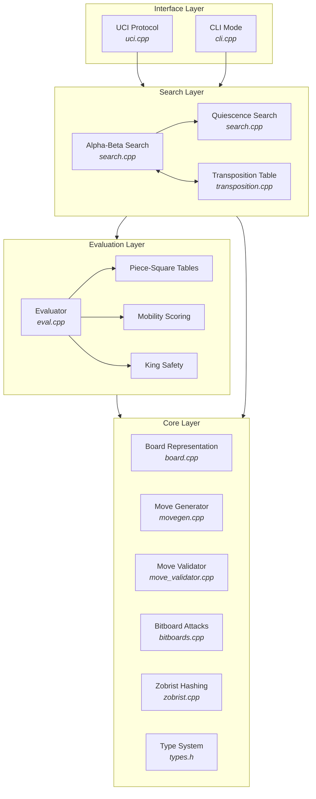

# Nyx Chess Engine

<div align="center">

[](LICENSE)


**A high-performance UCI chess engine written in C++17**

</div>

---

## Overview

Nyx is a bitboard-based chess engine with alpha-beta search, quiescence search, transposition tables, and iterative deepening with time management. It speaks the UCI protocol for compatibility with any chess GUI (Arena, ChessBase, etc.) and includes a built-in CLI for direct terminal play.

---

## Architecture



### Data flow

1. **Interface** receives a position (UCI `position` or CLI `board`/`move`) and delegates to Search
2. **Search** explores the game tree using alpha-beta pruning, consulting the Transposition Table for cached results
3. **Evaluation** scores leaf nodes by material, piece-square tables, mobility, and king safety
4. **Core** provides bitboard move generation, legal move validation, and incremental board state updates

---

## Project structure

```
nyx/
├── src/
│   ├── core/                  # Core chess primitives
│   │   ├── board.cpp          # Board representation, make/unmake move, FEN
│   │   ├── bitboards.cpp      # Precomputed sliding-piece attack tables
│   │   ├── movegen.cpp        # Bitboard legal move generation
│   │   ├── move_validator.cpp # UCI move parsing and legality checks
│   │   ├── eval.cpp           # Position evaluation (material, PST, mobility, king safety)
│   │   ├── zobrist.cpp        # Zobrist hashing implementation
│   │   ├── bitops.h           # Portable popcount/ctz intrinsics (GCC, Clang, MSVC)
│   │   └── types.h            # Enums, bitboard typedefs, square utilities
│   ├── search/
│   │   ├── search.cpp         # Alpha-beta, quiescence, aspiration, time management
│   │   └── transposition.cpp  # Transposition table with Zobrist key storage
│   └── interface/
│       ├── uci.cpp            # UCI protocol handler
│       └── cli.cpp            # Command-line REPL
├── tests/                     # Unit test suites
│   ├── test_movegen.cpp
│   ├── test_eval.cpp
│   └── test_search.cpp
└── Makefile                   # Build system
```

---

## Features

### Search
| Feature | Status |
|---------|--------|
| Alpha-beta pruning with PVS | Done |
| Quiescence search (8-ply limit) | Done |
| Transposition table (Zobrist-keyed) | Done |
| Iterative deepening | Done |
| Aspiration windows | Done |
| Time management (`check_time()`) | Done |
| Null move pruning | Done |
| Principal Variation collection | Done |
| Repetition detection | Done |

### Evaluation
| Component | Description | Status |
|-----------|-------------|--------|
| Material | Piece value summation (P=100, N=320, B=330, R=500, Q=900) | Done |
| Piece-Square Tables | Middlegame and endgame PST with game-phase interpolation | Done |
| Mobility | Bonus per non-pawn legal move | Done |
| King safety | Pawn shield bonus, exposed-king penalty | Done |
| Game-phase tapering | Opening to endgame smooth blend | Done |

### Interface
| Protocol | Description | Status |
|----------|-------------|--------|
| UCI | Full protocol for GUI integration | Done |
| CLI | Interactive REPL with `board`/`move`/`eval` commands | Done |

### Portability
| Platform | Support |
|----------|---------|
| Linux / macOS | GCC / Clang, Makefile build |
| Windows | MinGW-w64 (MSYS2) with CPU intrinsics dispatch |

---

## License

Nyx is open source software released under the [MIT License](LICENSE).

---

## Contributing

Contributions are welcome! Open an issue or submit a pull request on [GitHub](https://github.com/Dhruv-1608/Nyx).

---

## Project Stats


---

<div align="center">
<sub>Built with ♟️ by Dhruv — powered by C++17 and bitboards</sub>
</div>
